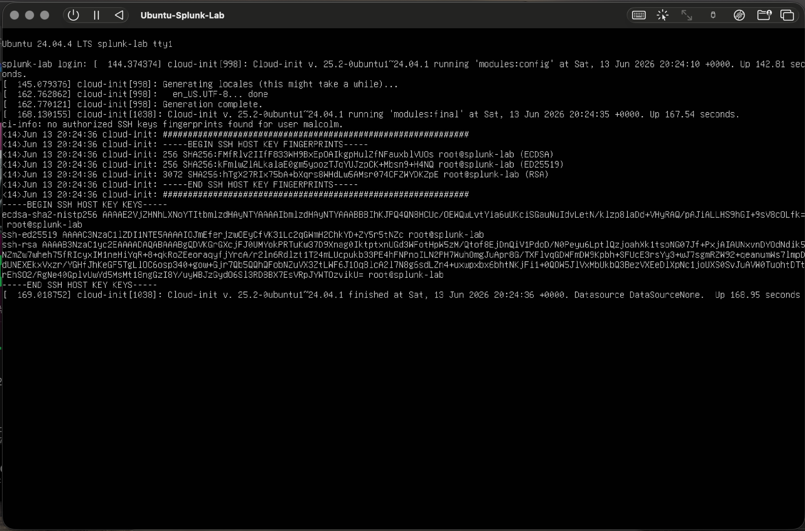
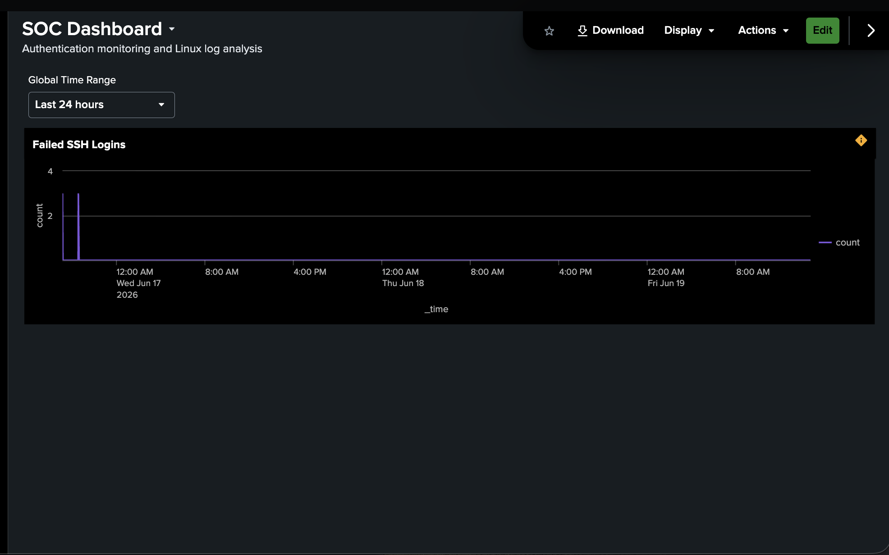
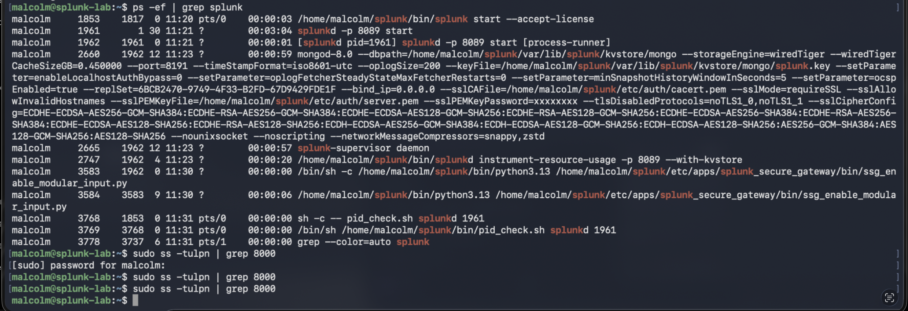

# SOC Home Lab – Splunk Enterprise on UTM

## Overview

This project documents the creation of a Security Operations Center (SOC) home lab built using UTM virtualization on a MacBook Air M1. The lab was designed to gain hands-on experience with SIEM deployment, Linux administration, log analysis, dashboards, alerts, and security monitoring.

## Lab Environment

**Host System**
- Apple MacBook Air (M1)
- 8 GB RAM
- macOS

**Virtualization**
- UTM

**Virtual Machines**
- Ubuntu Server
- Windows 11 ARM

**SIEM**
- Splunk Enterprise

**Remote Administration**
- SSH

---

## Tools Used

- Splunk Enterprise
- Ubuntu Server
- Windows 11 ARM
- UTM Virtualization
- SSH
- macOS Terminal

---

## Objectives

- Build a functional Security Operations Center (SOC) home lab.
- Deploy and configure Splunk Enterprise on Ubuntu Server.
- Practice Linux system administration using SSH.
- Analyze system and security logs within Splunk.
- Create dashboards and alerts for monitoring events.
- Gain hands-on experience with virtualization and SIEM technologies.

---

## What I Accomplished

- Built a SOC-style home lab using UTM virtualization on a MacBook Air M1.
- Installed and configured Ubuntu Server as the Splunk host.
- Installed Splunk Enterprise on Ubuntu Server.
- Accessed Splunk through a web browser.
- Used SSH from macOS Terminal to remotely administer the Ubuntu server.
- Ran Splunk searches to review indexed log activity.
- Created dashboards and alerts for basic security monitoring.
- Tested Windows 11 ARM as a potential endpoint log source.
- Documented setup issues, troubleshooting steps, and resource limitations.

---

## Skills Demonstrated

- SIEM deployment
- Splunk search basics
- Linux administration
- SSH remote access
- Virtual machine configuration
- Log analysis
- Dashboard creation
- Alert configuration
- Technical troubleshooting
- Cybersecurity documentation

---

## Challenges and Troubleshooting

This lab was completed on a resource-limited MacBook Air M1 with 8 GB of RAM. During the project, I encountered virtualization, performance, and compatibility challenges while working with Ubuntu Server, Splunk Enterprise, Windows 11 ARM, and Sysmon configuration.

SSH was used as a workaround for VM copy/paste limitations, and Splunk performance limitations were documented as part of the learning process.

---

## Future Improvements

- Add sanitized screenshots of the lab environment.
- Add more Splunk searches for authentication and system activity.
- Continue testing Windows endpoint log forwarding.
- Explore Wazuh as a lighter SIEM option for the M1 lab environment.
- Add additional dashboards and alerts.

## Lab Screenshots

### Ubuntu Server

---

### Splunk Dashboard

---

### SSH Administration

